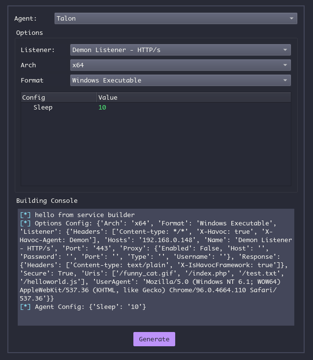
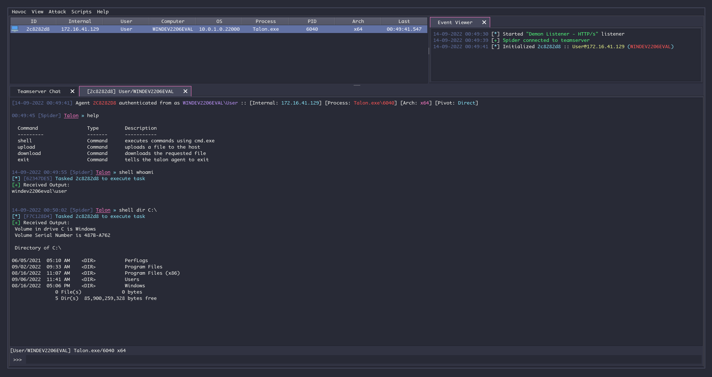

# Revenant

Revenant is a 3rd party agent for Havoc written in C, and based on Talon. This implant is meant to expand on the Talon implant by implementing covert methods of execution, more robust capabilities, and more customization.

The original Talon description can be found below.

-------------------------------------------------------------------------------------------------------------------------------------------------------------------------

Talon is a 3rd party agent for Havoc written in C. It's very minimalistic and it's meant to show how to work with the Havoc service api.
Talon.py is the script that handles callbacks, register reqeuest and tasks by interacting with the Havoc service api. 

